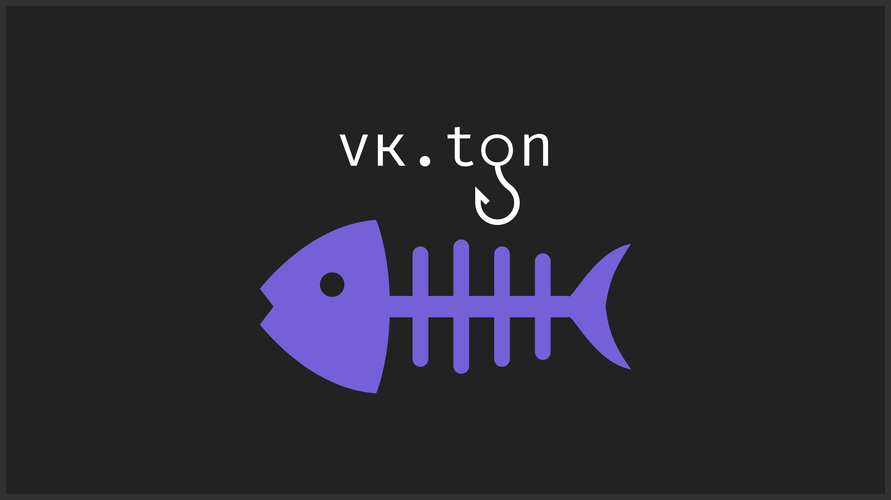

<div align="center" id="top"> 
  

  &#xa0;

  <!-- <a href="https://vkton.netlify.app">Demo</a> -->
</div>

<h1 align="center">vkton</h1>

<p align="center">
  

  

  

  

  

  

  

  
</p>

<!-- Status -->

<!-- <h4 align="center"> 
	🚧  VK Ton 🚀 Under construction...  🚧
</h4> 

<hr> -->

<p align="center">
  <a href="#о-библотеке">О библотеке</a> &#xa0; | &#xa0; 
  <a href="#преимущества">Преимущества</a> &#xa0; | &#xa0;
  <a href="#технологии">Технологии</a> &#xa0; | &#xa0;
  <a href="#начало">Начало</a> &#xa0; | &#xa0;
  <a href="#лицензия">Лицензия</a> &#xa0; | &#xa0;
  <a href="https://github.com/AlexLovser" target="_blank">Автор</a>
</p>

## Содержание
<p align="left">
  <a href="#каждой-функции-вы-можете-добавить-параметры">Параметры для команд</a> <br>
  <a href="#параметры-для-отправки-сообщения">Параметры для сообщения</a> <br>
  <a href="#вы-можете-удобно-настроить-ряды-кнопок-с-помощью-списков">Кнопки и их конфигурация</a> <br>
  <a href="#создания-запланированных-действий">Таск-лупы</a> <br>
  <a href="#отправка-карусели">Отправка каруселей</a> <br>
  <a href="#ожидание-ответа-от-пользователя">Ожидание ответа от пользователя</a> <br>
  <a href="#ожидание-ответа-от-нескольких-пользователей">Ожидание ответа от нескольких пользователей</a> <br>
  <a href="#переадресация-и-возвращение-назад">Переадресация и возвращение назад</a> <br>
  <a href="#события">События</a> <br>

</p>


<br>

## :dart: О библотеке ##

`vkton` это модуль для упрощенного создания VK ботов на Python. В библиотеке вы найдете все необходимые классы, для ванильного использования vk-api.

## :sparkles: Преимущества ##

:heavy_check_mark: Удобное и быстрое создание цепочек команд;\
:heavy_check_mark: Возможность разделять код в несколько файлов;\
:heavy_check_mark: Все необходимые функции для быстрого старта;

## :rocket: Технологии ##

Технологии использованные в проекте:

- [Python3](https://python.org/)
- [VK-API](https://dev.vk.com/ru/reference)


## :checkered_flag: Начало ##

```bash
# Установка самого модуля
$ pip install vkton

# Проверка, что все зависимости установлены
$ pip install PIL vk-api

```

Мой модуль гибко решает проблему навигации в боте. В каждом декораторе команды обязательным является параметр `back_to`. В него следует вписать название функции, которая будет вызвана в случае попытки пользователем выйти назад. Это позволяет не задумываясь сделать вложенные меню.
Если вы описываете корневое меню, то впишите в `back_to` его же название.

Команду можно вызвать по любому слову из **keywords** или по названию функции (hello, meteo ...)

```py
from vkton import Bot, Commands, Context
from vkton.ui import Button


bot = Bot("*group token here*", group_id=<айди группы>)  # активация бота


@Commands.command(keywords=["Привет", 'Say hello'], back_to='hello')
def hello(ctx: Context):
	ctx.user.send(
		'Hello, my Friend! You are using vkton by Alex Lovser! Nice to see you!',
		keys=[
			Button('Погода', 'white'),
			Button('Кнопка с ссылкой', 'red', link='https://pornhub.com')
		]
	)


@Commands.command(keywords=['Погода'], back_to='hello') 
def meteo(ctx: Context):
	ctx.user.send(
		'Погода обещает быть замечательной',
		keys=[
			bot.back_button # Заготовленная красная кнопка "Назад"
		]
	)


bot.run() # запуск бота

```

Вы также можете разделять код.
Для этого вам необходимо написать все те же функции в любом файле, а далее просто импортировать их в главный файл. Сразу после импорта, ваши команды их других файлов будут добавлены в бота.

### __Каждой функции вы можете добавить параметры:__
```py
	@Commands.command(keywords=['Какой-то тест'], back_to='hello') 
	def test(ctx: Context, arg1, arg2):
		ctx.user.send(
			f'Вы отправили команду "test" где arg1={arg1} arg2={arg2}',
		)

	# Отправка: Какой-то тест 1000 Вася
	# Ответ от бота: Вы отправили команду "test" где arg1=1000 arg2=Вася
```
Если параметром должно быть упоминание пользователя\
Например: Передать привет @alexlovser\
Можно использовать готовый метод **bot.parse_tag** для получения id того, кого упомянули:

```py
	@Commands.command(keywords=['Передать привет'], back_to='hello') 
	def say_hello(ctx: Context, mention):
		mentioned_user_id = bot.parse_tag(mention) # -> int | None
		if mentioned_user_id is not None:
			mentioned_user = bot.get_user(mentioned_user_id) # -> User | None
			if mentioned_user:
				mentioned_user.send(f'{ctx.user.tag} передал вам привет!')
```

### __Параметры для отправки сообщения:__
`:text:` - Текст на сообщения\
`:keys:` - Список со сгруппированными кнопкми для сообщения\
`:attachments:` - Для прикрепления вложений к сообщению. Вложения должны быть в формате, который рекомендует [документация ВК](https://dev.vk.com/ru/reference/objects/attachments-message) или с помощью класса **vkton.objects.Attachment**\
`:carousel:` - В случае отсутствия кнопок можно добавить к сообщению карусель. Сделать это возоможно с помощью класса **vkton.ui.CarouselField**.


### Вы можете удобно настроить ряды кнопок с помощью списков

```py
... 
keys=[
	[ # Если вы хотите сгруппировать кнопки на одном ряду, то просто оберните их в список
		Button('1', 'white'), Button('2', 'white'),
	],
		Button('3', 'white'), Button('4', 'white'), Button('5', 'white'),
	[
		bot.back_button
	]
]
# [   1  ][  2  ]
# [ 3 ][ 4 ][ 5 ]
# [    Назад    ]

...
```
### __Каждая кнопка принимает несколько параметров:__
**Обязательные** *<Позиционные>*\
`:title:` - Текст на кнопке\
`:color:` - 'red', 'green', 'blue', 'white' или те же слова на русском языке. Цвет самой кнопки.

**Необязательные** *<Именные>*\
`:link:` - Используется для создания кнопки-ссылки\
`:inline:` - Если в сообщении хотябы одна кнопка имеет данный параметр *True*, то кнопки появляются не в клавиатуре, а под сообщением.\
`:payload:` - Словарь с контекстными данными для команды. После нажатия кнопки в объекте **ctx.message.payload** можно будет увидеть эти данные


## __Создания запланированных действий:__
Очень часто нам необходимо циклично выполнять какие-либо действия в боте раз в заданный промежуток времени. Например раз в десять минут делать запрос в базу данных.
Данный модель предоставляет удобное решение для данной задачи:
```py
@Commands.task(timeout=3600) # время в секундах
def say_hello_task():
	bot.get_user(12345678).send(
		'Hello, world!',
		attachments='photo12345678_12345678'
	)
```
В данном случае бот будет раз в 1 час (3600 секунд) отправлять пользователю с id = 123456789 сообщение.
**При перезупуске бота таймер сбрасывается**

## __Отправка карусели:__
```py
from vkton.ui import CarouselField


@Commands.command(keywords=['Карусель'], back_to='start') 
def carousel(ctx: Context):
	bot.get_user(12345678).send(
		'Hello, world!',
		carousel=[
			CarouselField(
				photo_id='photo12345678_12345678',
				title='TITLE1',
				description='description1',
				buttons=[
					Button('Подробнее', 'blue', payload={'some_id': '12345'})
				]
			),
			CarouselField(
				photo_id='photo12345678_12345678',
				title='TITLE2',
				description='description2',
				buttons=[
					Button('Подробнее', 'blue', payload={'some_id': '67890'})
				]
			),
		]
	)
```

## __Ожидание ответа от пользователя:__
```py

	ctx.user.send('Сколько будет 2 + 2?')

	# Если check() возвращает True, то код продолжится и будет возращено сообщение пользователя
	# Иначе бот будет продалжать ждать сообщение от пользователя
	def check(message: vkton.objects.Message) -> bool:
		return message.content == '4'

	user_message = bot.wait_message(ctx.user, timeout=24 * 3600, check=check) # -> <Message> | None

	if user_message is not None:
		user.send('Правильно! Это 4')
	else:
		user.send('Правильного ответа не поступило')

```

## __Ожидание ответа от нескольких пользователей:__
Так как функция **wait_message** блокирует выполнение кода, ожидать ответ от нескольких пользователей не представляется возможным. Поэтому в качестве первого аргумета можно передать массив с пользователями, и бот будет ожидать сообщения от них одновременно.
```py

users = [
	bot.get_user(12345678),
	bot.get_user(87654321),
	bot.get_user(12348765),
]

for user in users:
	user.send('Сколько будет 2 + 2?')

check = lambda message: message.content == '4'

messages = bot.wait_message(users, timeout=5 * 60, check=check) # -> dict[user_id, <Message> | None]

# По окончании вы получите словарь с данными ответов от нескольких пользователей
# Если пользователь не ответил или ответ не прошел проверку, то вместо сообщения будет None

print(messages)

```

## __Переадресация и возвращение назад:__
Объект **Commands** имеет два удобных метода для переадресации:

### Commands.go_back(ctx)
Данный метод выходит из выполняемой функции и запускает функцию, обозначенную в **back_to** (в декораторе)

### Commands.redirect(ctx, to)
Чтобы попасть вопределенную точку программы, можно вызвать данный метод, в параметр **to** необходимо вписать название конкретной функции


## __События:__
Вы также можете отслеживать некоторые события:

```py

@Commands.event()
def on_message(message: vkton.objects.Message):
	print(message.content)

```

Данный пример единственного на данный момент события, доступного разработчикам, это **on_message**. Каждый раз, когда бот будет получать сообщение, данная функция будет вызываться и вы сможете более широко работать с пользователями. Очень можно называть события именно так, как это предусмативает библиотека, иначе вы получите ошибку. \
Со временем я буду стараться увеличивать число доступных событий.

## Лицензия ##

This project is under license from MIT. For more details, see the [LICENSE](LICENSE.md) file.


С :heart: от <a href="https://github.com/AlexLovser" target="_blank">Alex Lovser</a>

&#xa0;

<a href="#top">Вернуться вверх</a>
